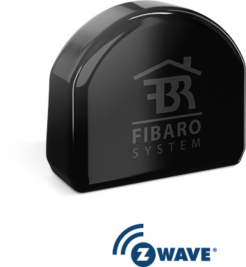
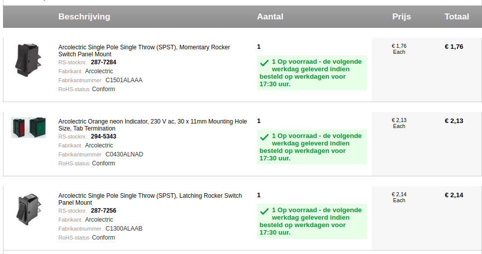

# D.E. Moccamaster - FIBARO switch project

This document describes a modification that I did, in order to make my
coffee maker machine controllable via home automation.

## But why?

I started out by doing the obvious, and connecting the machine to a smart power plug.
That had an important drawback: you end up with two switches that must work in unison:
the switch on the plug and the switch on the coffee maker. This conflicted with the
two basic use cases that I wanted to support:

  1. Walk up to the machine, prepare it and turn it on by hand.
  2. Prepare the machine and turn it based on some home automation trigger.

For use case 1, it would be best when the power plug was already on, so using the
switch on the machine would turn it on right away, without having to fumble with
an app to turn on the power plug as well. Not to hard. A basic "if somebody walks
into the kitchen, turn on the power plug" would do. However, this would not work
for use case 2.

For use case 2, it is easy enough to turn on the power plug based on a trigger.
However, it is required that the switch on the machine is already turned on.
When one forgets to turn on that switch during preparation, switching on the
power plug will have no effect. Big disappointment.

My conclusion was that there should be only one switch to rule the machine.

## The solution

Keeping the [WAF](https://en.wikipedia.org/wiki/Wife_acceptance_factor) in mind,
switching on and off the machine should be controllable by both home automation
triggers and a physical switch on the machine.

The type of Moccamaster that I own, is model KBG, type 741.62/B. This is a
version of Technivorm B.V.'s machine that is sold by Douwe Egberts (a coffee
brand). It has two switches: "on/off" and "extra hot". The "extra hot" switch
turns on a second heater element below the heating plate, used to keep a
full pot of coffee hot. My experience is that "extra hot" will make the
coffee bitter quickly, so I don't use it.

Based on this, I came up with the following plan:

  1. Replace the "on/off" toggle switch with a momentary switch (i.e. a switch that
     only makes contact when pressed)
  2. Replace the "extra hot" toggle switch with an indicator light.
  3. Add a [FIBARO switch](https://www.fibaro.com/en/products/switches/) to the
     internals of the coffee machine. This switch can be controlled via both Z-wave
     and the momentary switch.

## Materials

I used a FIBARO switch 2. Of course, for you own project, you can use any switch
that has the same kind of features, e.g. an icasa Zigbee switch. I used the FIBARO,
because I have Z-wave support in my Home Assistant setup and because the switch
is small and therefore easy to fit.

Finding a good momentary switch and indicator light was quite a hunt. Finding
spare parts is easy enough, but I wanted different components than the original.
Eventually I figured out that [Arcolectric 6000 splash proof components](../Documentation/Arcolectric%20switches%206000%20splash%20proof.pdf) were the way to go.
Unfortunately, it turned out to be somewhat impossible to find the specific
ones that I wanted. Eventually, I found the components from the order below, which
were a good alternative:

