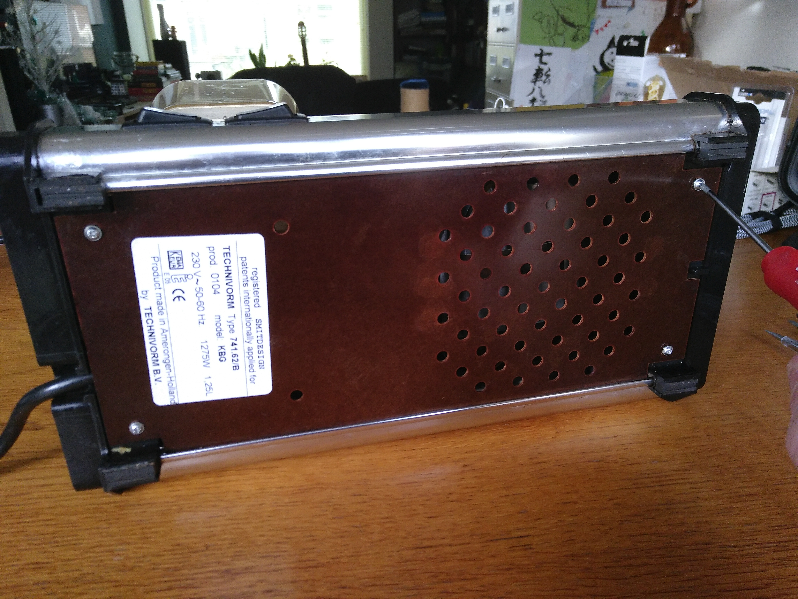

# D.E. Moccamaster - FIBARO switch project

This document describes a modification that I did, in order to make my
coffee maker machine controllable via home automation.

## But why?

I started out by doing the obvious, and connecting the machine to a smart power plug.
That had an important drawback: you end up with two switches that must work in unison:
the switch on the plug and the switch on the coffee maker. This conflicted with the
two basic use cases that I wanted to support:

  1. Walk up to the machine, prepare it and turn it on by hand.
  2. Prepare the machine and turn it based on some home automation trigger.

For use case 1, it would be best when the power plug was already on, so using the
switch on the machine would turn it on right away, without having to fumble with
an app to turn on the power plug as well. Not to hard. A basic "if somebody walks
into the kitchen, turn on the power plug" would do. However, this would not work
for use case 2.

For use case 2, it is easy enough to turn on the power plug based on a trigger.
However, it is required that the switch on the machine is already turned on.
When one forgets to turn on that switch during preparation, switching on the
power plug will have no effect. Big disappointment.

My conclusion was that there should be only one switch to rule the machine.

## The solution

Keeping the [WAF](https://en.wikipedia.org/wiki/Wife_acceptance_factor) in mind,
switching on and off the machine should be controllable by both home automation
triggers and a physical switch on the machine.

The type of Moccamaster that I own, is model KBG, type 741.62/B. This is a
version of Technivorm B.V.'s machine that is sold by Douwe Egberts (a coffee
brand). It has two switches: "on/off" and "extra hot". The "extra hot" switch
turns on a second heater element below the heating plate, used to keep a
full pot of coffee hot. My experience is that "extra hot" will make the
coffee bitter quickly, so I don't use it.

Based on this, I came up with the following plan:

  1. Replace the "on/off" toggle switch with a momentary switch (i.e. a switch that
     only makes contact when pressed)
  2. Replace the "extra hot" toggle switch with an indicator light.
  3. Add a smart switch to the internals of the coffee machine, which can be controlled
     both remotely and using the momentary switch.

A document that proved to be an invaluable resource for this mod, is the
[spare part and safety document](../Documentation/Moccamaster%20manual%20spare%20parts.pdf).
The document provides schematics for a wide range of Moccamaster models in both
actual and logical layout. This helped a lot in planning the mod steps.

## Required components

I used a FIBARO switch 2. Of course, for you own project, you can use any switch
that has the same kind of features, e.g. an icasa Zigbee switch. I used the FIBARO,
because I have Z-wave support in my Home Assistant setup and because the switch
is small and therefore easy to fit.

Finding a good snap-in style momentary switch and indicator light was quite a hunt. Finding
spare parts is easy enough, but I wanted different components than the original.
Eventually I figured out that [Arcolectric 6000 splash proof components](../Documentation/Arcolectric%20switches%206000%20splash%20proof.pdf) were the way to go.
Unfortunately, it turned out to be somewhat impossible to find the specific
ones that I wanted. Eventually, I found the components from the order below, which
were a good alternative:

As you can see, I also ordered a rocker switch. I wasn't fully sure if the
momentary switch would be the best option. It turns out it was, and the rocker
switch was not used.

For connecting wires together, I made use of a few Wago welding clamps ("lasklemmen" in Dutch).
I find this by far the easiest way to connect the wires in a non-destructive way.

Finally, I used a few pieces of additional PVC coated copper wire. I used the kind of
wire that you would normally use in the electric installation of your house (since I had
that lying around). These wires are a lot thicker than the wires that are already in
the machine, so I don't have to worry about the wires heating up.

## Mod steps

Let's start with the machine as it was at the start of the project. The original
buttons in place and still using a smart plug.

Okay, let's get cracking. First, remove the four screws on the bottom.

The clamp on the right side can now be removed. Instead of removing it,
I just shifted it a bit, allowing the bottom plate to come free.

Here's what the internals look like. On the left the power wire enters
the machine. Switches are visible on top, the water heater is on the
left and the heater plate is on the right.

Here's a close up of the switch terminals. The top switch is the
"on/off" switch, the bottom one is the "extra hot" switch.
The terminals are lettered for reference in the rest of this document.

  * __A__. the N terminal of the "on/off" switch, used by the light in the button.
  * __B__. the Q terminal of the "on/off" switch, powering the device.
  * __C__. the L terminal of the "on/off" switch, connected to the power cable L line.
  * __D__. the L terminal of the "extra hot" switch, used for powering the light in
           the button and the secondary heating element. There's a bit of a kludge on this
           terminal, but that is simply two wires connected to the same terminal.
  * __E__. the Q terminal of the "extra hot" switch, powering the secondary heating element.
  * __F__. the N terminal of the "extra hot" switch, used by the light in the button.
 

Disconnect terminal A on the "on/off" switch and clip off the cable lug ("kabelschoen" in Dutch).
Strip the two wires.

Push the two stripped wires in a welding clamp. Take a new wire (I used a blue one, since these
wires are connected to the power cable N line), strip it and add it to the welding clamp as well.

The other side of the blue wire is left as-is for now. It will go into the N-terminal of the FIBARO
switch later on. Leaving it unconnected for now, makes moving the wires around easier.

Time to install the FIBARO switch in the machine. I first stick some double-sided tape to the bottom.

Then I stick the switch below the earth line in the back of the machine. I place the switch between the 
water cooker element and the heater plate, so it's as far away as possible from both heat sources.
I'm not too worried about the heat, since I can touch the machine's metal housing on the ouside
while the coffee is being made, without burning my fingers.

Disconnect terminal B from the "on/off" switch. In the picture you can see me using pliers
to pull off the cable lug.

Cut off the cable lug, strip the wire and push the wire in a welding clamp. Take a new wire (for this
one I used black wire, since this is the switch wire that will be connected to the FIBARO Q terminal),
strip it and add it to the welding clamp as well.

Strip the other end of the black wire and connect it to the Q-terminal of the FIBARO switch.

Note that the wire that came off terminal B is quite short. That is why the welding clamp is quite a
bit down on the following picture picture.

Disconnect terminal C from the "on/off" switch and cut off the cable lug.

Strip the cable and push it in a welding clamp. Take a new wire (for this one I used brown wire, since
this is the cable that runs to the power cable L line), strip it and add it to the welding clamp as well.

Strip the other end of the brown wire and connect it to an L-terminal of the FIBARO switch.

All three terminals of the "on/off" switch are now disconnected.
Uninstall the snap-in switch. I use a screwdriver to squeeze the two tabs on the side
(this takes some force) from the inside of the machine to the outside

After this, remove the switch.

Install the new momentary rocker switch by pushing it into the cutout.

